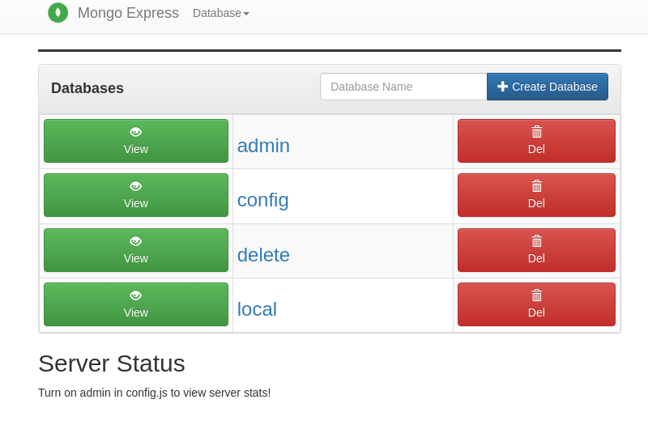

# minikube

Basic application which runs mongodb and mongo-express in `minikube`. `minikube` must be installed on the system in advance.

Create secret

```
kubectl apply -f secret.yaml
```

Create configmap

```
kubectl apply -f config.yaml 
```

Deploy mongodb

```
kubectl apply -f mongodb.yaml
```

Deploy mongodb-express

```
kubectl apply -f mongodb-express.yaml
```

Expose service

```
minikube service mongodb-express-service
```

Run tunel. This process must be running, otherwise you will not be able to access the mongo-express web page

```
minikube tunnel

> Status:	
> 	machine: minikube
> 	pid: 420884
> 	route: 10.96.0.0/12 -> 192.168.49.2     <- IP address
> 	minikube: Running
> 	services: [mongodb-express-service]
>     errors: 
> 		minikube: no errors
> 		router: no errors
> 		loadbalancer emulator: no errors
```

Access mongo-express in your browser. IP to access mongo-express is in above command's output - **192.168.49.2** - `http://192.168.49.2:30000`

